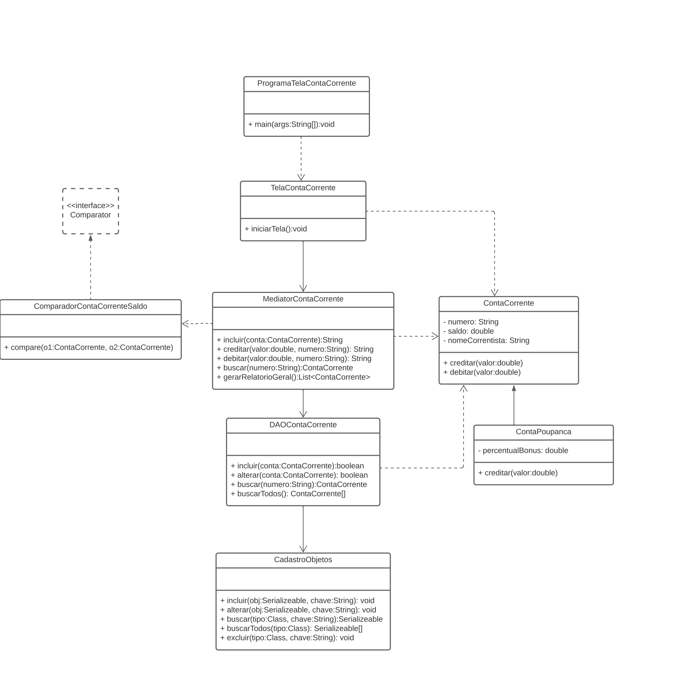

# Projeto next

Repositório de códigos e exercícios da aula 17 do curso NExT 2023.1

## Instruções para iniciar o projeto via class room:

1. Criar um projeto JAVA chamado ProjetoNext2023.
2. Descompactar o arquivo projetomodelo.zip em uma pasta do sistema de arquivos.
3. Localizar, na pasta onde o zip foi descompactado, o diretório SRC.
4. Selecionar tal diretório e copiar (CTRL-C).
5. Na IDE, selecionar o projeto criado ProjetoNext2023.
6. Colar (CTRL-V) o diretório SRC copiado.
7. Os passos 3-6 correspondem a uma forma simplificada de colocar as classes de
referência em um projeto. Existem outros caminhos, que vão igualmente resultar na
estrutura de pacotes e nas classes dentro de um projeto JAVA típico.
8. Baixar no diretório do projeto o arquivo PersistenciaObjetos.jar.
9. Incluir no projeto a dependência de PersistenciaObjetos.jar. 
    
    No Eclipse, seguir os seguintes passos:
    * Selecionar o projeto, clicar no botão direito, que dá acesso ao menu de contexto.
    * Clicar na opção Properties.
    * Abre-se uma janela com algumas opções. Clicar em Java Build Path e selecionar a aba Libraries.
    * No espaço “JARs and class folders on the build path”, selecionar Classpath.
    * No lado esquerdo, clicar em Add External JARs...
    * Abre-se uma janela para seleção de arquivos. Selecionar o arquivo PersistenciaObjetos.jar.

    No vscode:
        * Copie o arquivo PersistenciaObjetos.jar para a pasta lib, e pronto.

## Instruções para iniciar o projeto via github:

1. faça o clone deste repositorio com o seguinte código:
    * ```git clone https://github.com/NExT-2023-1/aula17.git```
2. pronto, pode usar.

## Atividade

impletamente as classes do diagrama abaixo, de acordo com as seguintes definições:



1. Classe ComparadorContaCorrenteSaldo:
    * Implementa a interface Comparator (do JAVA)
    * Atributos – sem atributos
    * Métodos:
        * Construtor padrão.
        * int compare(ContaCorrente o1, ContaCorrente o2)
            - Deve retornar 1 se o saldo de o1 for maior do que o saldo de o2.
            - Deve retornar -1 se o saldo de o1 for menor do que o saldo de o2.
            - Deve retornar 0 se o saldo de o1 for igual ao saldo de o2.
2. Classe MediatorContaCorrente
    * Atributos: daoContaCorrente (do tipo DAOContaCorrente). Uma instância deve ser atribuída ao atributo na sua própria declaração.
    * Métodos:
        * Construtor padrão.
        * String incluir(ContaCorrente conta)
            * Deve validar os dados da conta corrente recebida e, se algum dado estiver inválido, retornar mensagem pertinente. As seguintes validações devem ser feitas:
                * numero: dever ser diferente de nulo e de branco, e ter tamanho mínimo de 5 caracteres e máximo de 8 caracteres.
                * saldo: deve ser maior ou igual a zero.
                * nomeCorrentista: dever ser diferente de nulo e de branco, e ter tamanho máximo de 60 caracteres.
                * Se a conta corrente recebida for uma conta poupança, validar o percentual de bônus que deve ser maior ou igual a zero.
            
            Se os dados estiverem válidos, incluir a conta corrente no mecanismo de persistência usando o DAO. O retorno false do incluir do DAO indica que a chave da conta corrente (o seu número) já existe. Se isto ocorrer, retornar mensagem pertinente. Caso a inclusão seja realizada com sucesso, retornar null.
        * String creditar(double valor, String numero)
            * Deve validar os dados recebidos. se algum dado estiver inválido, retornar mensagem pertinente. As seguintes validações devem ser feitas:
                * valor tem que ser maior ou igual a zero.
                * numero tem que ser diferente de nulo e de branco.
            
            O método deve buscar no DAO a conta corrente por número. Se ela não existir, retornar mensagem pertinente. Se ela existir, creditar, usando o método da conta corrente, valor na conta, alterar, no DAO, a conta, e retornar null.
        * String debitar(double valor, String numero)
            * Deve validar os dados recebidos. se algum dado estiver inválido, retornar mensagem pertinente. As seguintes validações devem ser feitas:
                * valor tem que ser maior ou igual a zero.
                * numero tem que ser diferente de nulo e de branco.
            
            O método deve buscar no DAO a conta corrente por número. Se ela não existir, retornar mensagem pertinente. Se ela existir, verificar se o saldo atual é menor que valor, se for, retornar mensagem pertinente. Caso contrário, debitar, usando o método da conta corrente, valor na conta, alterar, no DAO, a conta, e retornar null.

        * ContaCorrente buscar(String numero)
            * Se numero for nulo ou branco, retornar null. Caso contrário, realizar busca por número no DAO e retornar o retorno desta busca.
        * List<ContaCorrente> gerarRelatorioGeral()
            * Implementar tal método seguindo o modelo implementado no exemplo de Produto. A lista de contas correntes retornada deve estar ordenada por saldo, em ordem crescente. Para isto, usar o ComparadorContaCorrenteSaldo, já implementado.

# Importante

PersistenciaObjetos.jar v1.1
- Ajuste para o CadastroObjeto suportar tipos e subtipos em um mesmo cadastro. É o caso de
ContaCorrente e ContaPoupanca.

1. Atualizar no projeto a dependência da PersistenciaObjetos.jar para o novo jar disponibilizado.

2. Na classe MediatorProduto, trocar a linha
private CadastroObjetos cadastro = new CadastroObjetos();
POR
private CadastroObjetos cadastro = new CadastroObjetos(Produto.class);

3. Na classe MediatorContaCorrente, trocar a linha
private CadastroObjetos cadastro = new CadastroObjetos();
POR
private CadastroObjetos cadastro = new CadastroObjetos(ContaCorrente.class);

## Getting Started

Welcome to the VS Code Java world. Here is a guideline to help you get started to write Java code in Visual Studio Code.

## Folder Structure

The workspace contains two folders by default, where:

- `src`: the folder to maintain sources
- `lib`: the folder to maintain dependencies

Meanwhile, the compiled output files will be generated in the `bin` folder by default.

> If you want to customize the folder structure, open `.vscode/settings.json` and update the related settings there.

## Dependency Management

The `JAVA PROJECTS` view allows you to manage your dependencies. More details can be found [here](https://github.com/microsoft/vscode-java-dependency#manage-dependencies).
